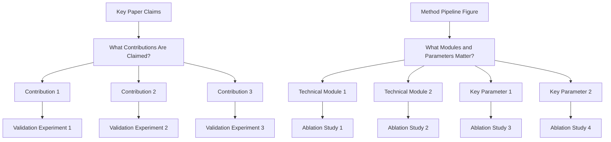
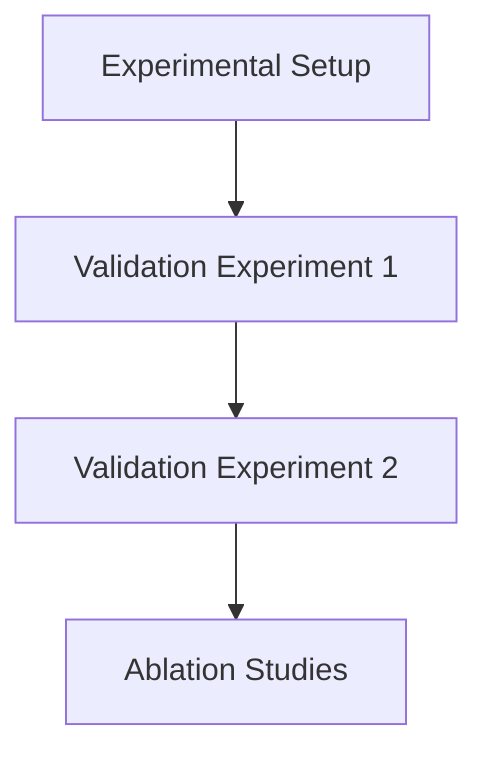

# Experiments Writing Guide

## Goal

Convince reviewers with complete evidence on effectiveness, causality, and practical value.
Treat the Experiments section as the evidence system for the paper's contributions, not as a collection of unrelated result tables.

## Analysis Paragraph Takeaway Rule

When writing experimental analysis, each analysis point or paragraph should begin with a concise conclusion sentence, preferably bolded.
This lets readers understand the takeaway before reading the numbers, comparisons, or explanations.

Recommended pattern:

1. Bold takeaway sentence: state the conclusion, trend, or answer to the experimental question.
2. Evidence: cite the table/figure and key numbers or qualitative observations.
3. Interpretation: explain why the result supports the claim, contribution, or design choice.
4. Boundary: mention failure cases, exceptions, or TODOs when evidence is incomplete.

Example skeleton:

`\textbf{Our method improves robustness under harder settings.} As shown in Table~\ref{tab:robustness}, ... This suggests that ...`

Do not start an analysis paragraph with raw numbers or table references before the takeaway.
If the evidence is missing, start with a weakened takeaway and a red TODO rather than overstating the result.

## Experiment Types and Roles

Plan experiments in three complementary roles:

1. Validation experiments: reveal or verify the key phenomenon, empirical finding, or problem diagnosis that motivates the work.
2. Supporting experiments: support the claimed contributions with strong performance indicators, safety/reliability evidence when relevant, broad coverage, and convincing comparisons.
3. Ablation experiments: test whether the proposed modules, hyperparameters, design choices, or training/inference components are reasonable and necessary.

Each major contribution should map to at least one supporting experiment.
Each method innovation should map to at least one ablation or controlled analysis.
Each important phenomenon or claim about the task should map to a validation experiment or diagnostic analysis.

## Experiment Visuals and Case Studies

Use figures and case-study panels to make experimental evidence easier to inspect.
When experiment data is available, create clean academic-style plots for trends and qualitative insight, but preserve polished tables for main numerical comparisons.

Main result table rule:

1. The main comparison should usually be presented as a high-quality table with exact numbers.
2. Plots should complement the table when they make trends, scaling, robustness, or ablations easier to understand.
3. Do not replace an important result table with a plot unless the claim is fundamentally trend-based.
4. If the main table is too dense, redesign and beautify the table before discarding it.

Tri-modal experiment presentation:

1. Text: explains the claim, takeaway, and interpretation.
2. Table: provides exact main results and baseline comparisons.
3. Figure: visualizes trends, ablations, robustness, distributions, or case studies.

When the data exists, generate experiment figures with Python or another reproducible plotting workflow.
Do not merely state that a plot would be useful.
Save generated plots under `figures/` and keep plotting scripts when possible.
For non-data-analysis illustrative visuals or polished showcase assets, use Image 2 when available, but never for figures that claim real experimental evidence.

Recommended visuals:

1. Performance plots for main comparisons when trends across datasets, tasks, model sizes, or settings matter.
2. Ablation plots for module contributions, hyperparameters, or sensitivity analysis.
3. Robustness/safety plots for harder settings, stress tests, or failure modes.
4. Distribution or diagnostic plots for validation experiments and discovered phenomena.
5. Case-study panels for qualitative behavior, representative examples, success/failure analysis, or practical workflow.

All experiment visuals must be faithful to real data.
If the needed data is unavailable, add a red TODO in the text, caption, and Visual Plan.

## Three Core Questions

1. Is the method better than strong baselines?
   - Run comparison experiments against strong and recent baselines.
   - Report standard metrics on the main benchmark(s).
   - Include SOTA or strongest public methods, not only weak baselines.
   - Keep protocol fair (same data split, preprocessing, and evaluation settings).
2. Which modules/design choices make the gain?
   - Run ablation studies for each key module/design choice.
   - Use remove/replace/disable variants and report delta to full model.
   - Include component interaction ablations when modules are coupled.
3. How far can the method generalize under harder settings?
   - Run demos/evaluations on harder or out-of-distribution settings.
   - Add stress-test scenarios (more complex scenes, rarer cases, noisier inputs, or stricter constraints).
   - Report both gains and failure modes to show realistic boundaries.

## Experiment Planning

## Baseline-to-Related-Work Alignment

Before finalizing experiments, ensure the selected baselines are reflected in Related Work.

For each baseline, check:

1. Is it introduced in Related Work, or is its method family introduced?
2. Is the reason for choosing it clear: direct competitor, strong recent method, standard classical method, practical system, or ablation-style comparison?
3. Does the experiment table/figure evaluate the claim that Related Work uses this baseline to position?
4. If an expected baseline is missing, is the reason documented or marked as TODO?

The baseline list should not appear suddenly in Experiments without narrative context.
The Related Work section should not emphasize a method family that is absent from Experiments unless comparison is impossible or out of scope.

## Contribution-to-Experiment Mapping

Before writing the Experiments section, build a compact map:

1. `Contribution -> Supporting experiment(s) -> Metric/table/figure -> Current status`
2. `Method innovation -> Ablation/control -> Expected question answered -> Current status`
3. `Phenomenon/finding -> Validation experiment/diagnostic -> Evidence artifact -> Current status`

If any entry is missing, mark it with the TODO directive instead of silently dropping it.

## Experiment Section Decomposition

## Experiment Section Granularity

Keep Experiments easy to scan without fragmenting it into many tiny sections.

Rules:

1. Use subsections for major experiment blocks, such as setup, main results, ablations, robustness/generalization, and case studies.
2. Do not create a new subsection for every metric, dataset, minor observation, or table row.
3. Use bold takeaway sentences inside paragraphs for individual analysis points instead of creating many small headings.
4. Put extra analyses, additional metrics, large tables, and extended case studies in appendix when they interrupt the main evidence flow.
5. Merge adjacent experiment subsections if they support the same claim or use the same evidence artifact.

## Figure/Table Writing Rules

`Good tables are part of experiment communication quality, not decoration.`

1. Figure captions and table captions are equally important in the writing quality of Experiments.
2. The main result table is often the most important experiment visual; keep it precise, readable, and aesthetically polished.

### Hard rules

1. Put caption above the table.
2. Avoid vertical lines (`|`) in tabular columns.
3. Do not use double rules or dense `\hline` stacks.
4. Use `booktabs` style (`\toprule`, `\midrule`, `\bottomrule`) for clean structure.
5. Use as few horizontal rules as possible; lines should separate groups, not every row.
6. Highlight key numbers (best/second-best or target rows) with subtle color emphasis.

### Readability rules from review practice

1. Label metric direction in column headers (for example `PSNR ↑`, `LPIPS ↓`).
2. Add units when needed so values are interpretable without guessing.
3. Align text columns left; keep numeric columns consistently aligned.
4. Keep numeric precision consistent (same decimal places within a metric column).
5. Group multi-dataset or multi-setting results using `\multicolumn` + `\cmidrule`, not vertical separators.
6. One table, one message: do not mix unrelated results in a single table.
7. If rows represent different attributes/ablations, encode that explicitly in row names or attribute columns.
8. Keep caption focused on setting/protocol/notation, not long discussion.
9. If there is little detail to explain, use one concise sentence to summarize the main result.
10. For single-column figures/tables in two-column papers, prefer placing them in the right column when layout allows, so readers can enter the page from the left-top text without breaking reading flow.

### Minimal LaTeX checklist

1. Add packages in preamble: `\usepackage{booktabs}`, `\usepackage{colortbl,xcolor}` (and optionally `\usepackage{siunitx}` for decimal alignment).
2. Replace `\hline`-heavy style with `\toprule/\midrule/\bottomrule`.
3. Put `\caption{...}` before `\label{...}` and keep caption above.
4. Use restrained highlighting; never color too many cells.

## Recommended Ablation Package

1. One core ablation table for all major contributions.
2. Several focused mini-ablations for module-level design choices.
3. Matching qualitative visual results for each important ablation.

## Experimental Rigor Checklist

1. Are baselines recent and relevant?
2. Are metrics sufficient and standard for this task?
3. Is ablation tied to every key design claim?
4. Are claims in Abstract/Introduction supported by reported numbers?
5. Are limitations of evaluation scope explicitly stated?
6. Does each contribution have visible experimental support?
7. Does each method innovation have an ablation or controlled justification?
8. Do validation experiments make the key phenomenon or discovery legible to readers?
